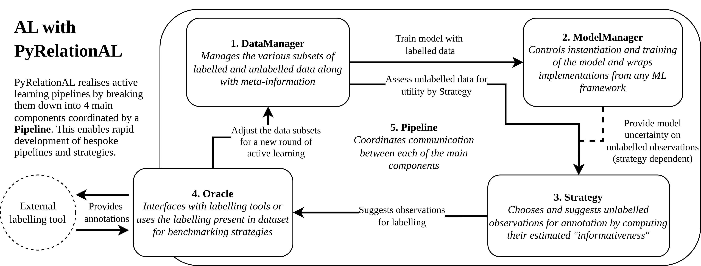

# PyRelationAL


[](https://badge.fury.io/py/pyrelational)
[](https://pyrelational.readthedocs.io/en/stable/?badge=stable)

PyRelationAL is an open source Python library for the rapid and reliable construction of active learning (AL) pipelines and strategies. The toolkit offers a modular design for a flexible workflow that enables active learning with as little change to your models and datasets as possible. The package is primarily aimed at researchers so that they can rapidly reimplement, adapt, and create novel active learning strategies. For more information on how we achieve this you can consult the sections below, our comprehensive docs, or our paper. PyRelationAL is principally designed with PyTorch workflows in mind (for Bayesian inference approximation with neural networks) but is designed from the start to be agnostic to the user's choice of ML framework for model implementation.

Detailed in the *overview* section below, PyRelationAL is centered around 5 modules for the development of AL pipelines and strategies. Allowing the user to freely focus on different aspects of the active learning cycle whilst ensuring other components adhere to a consistent API.

- **DataManager**: Data management in AL pipelines.
- **ModelManager**: Framework agnostic wrappers for ML models to work with PyRelationAL.
- **Strategy**: Module for developing active learning strategies.
- **Oracle**: Interfaces for different oracles and labelling tools.
- **Pipeline**: Facilitate the communication between different PyRelationAL modules to run an active learning cycle.
- *Uncertainty*: PyRelationAL also offers special wrappers for PyTorch modules that enable Bayesian inference approximation for deep active learning.

Furthermore, the package comes with a growing number of **benchmark datasets and default AL tasks** based on literature with associated public licenses to help researchers test their AL strategies and build on a common set of benchmarks.

One of our main incentives for making this library is to get more people interested in research and development of AL. hence we have made primers, tutorials, and examples available on our website for newcomers (and experienced AL practitioners alike). Experienced users can refer to our numerous examples to get started on creating custom pipelines and strategies in their AL projects.


## Quick install

```bash
pip install pyrelational
```

## The `PyRelationAL` package

### Example

```python
# Active Learning package
from pyrelational.data_managers import DataManager
from pyrelational.model_managers import ModelManager
from pyrelational.strategies.classification import LeastConfidenceStrategy
from pyrelational.oracles import BenchmarkOracle
from pyrelational.pipeline import Pipeline

# Instantiate data-loaders, models, trainers the usual Pytorch/PytorchLightning way
# In most cases, no change is needed to current workflow to incorporate
# active learning
data_manager = DataManager(dataset, train_indices, validation_indices,
  test_indices, labelled_indices)

# Create a ModelManager that will handle model instantiation, training and evaluation
model = ModelManager(ModelConstructor, model_config, trainer_config, **kwargs)

# Use the various implemented active learning strategies or define your own
strategy = LeastConfidenceStrategy()

# Interface with various dataset annotation tools or use an oracle for Benchmarking
oracle = BenchmarkOracle()

# Bring it all together within a Pipeline that manages the active learning cycle
pipeline = Pipeline(data_manager, model, strategy, oracle)

# Use the pipeline to run active learning cycles and log performance data
to_annotate = pipeline.step(num_annotate=5)
pipeline.run(num_annotate=10)
print(pipeline)
```

## Overview



The `PyRelationAL` package decomposes the active learning workflow into five main components: 1) a **DataManager**, 2) a **ModelManager**, 3) an AL **Strategy**, 4) an **Oracle** and 5) a **Pipeline** that runs the show.

The **DataManager** (`pyrelational.data_managers.DataManager`) wraps around a PyTorch Dataset object and handles dataloader instantiation as well as tracking and updating of labelled and unlabelled sample pools. The Dataset must have
specific properties for compatibility: 1) The labels must be contained within an attribute (by default PyRelationAL assumes that this is 'y', but the user can change this) 2) The `__getitem__` method returns a tuple of tensors, where the first element is a tensor of features

The **ModelManager** (`pyrelational.model_managers.ModelManager`) wraps a user defined ML model (e.g. PyTorch Module, Flax module, or scikit-learn estimator) and primarily handles instantiation, training, testing, as well as uncertainty quantification (e.g. ensembling, MC-dropout) if relevant. It enables the use of ML models implemented using different ML frameworks (for example see `examples/demo/model_gaussianprocesses.py` or `examples/demo/scikit_estimator.py`) with PyRelationAL workflows.

The AL **Strategy** (`pyrelational.strategies.Strategy`) defines an active learning strategy. We like to typically think of strategies being compositions of an *informativeness measure* and a *query selection algorithm* that selects observations based on the perceived informativeness. Together they compute the utility of a query or set of queries for a batch active mode strategy. We define various classic strategies for classification, regression, and task-agnostic scenarios based on the informativeness measures defined in `pyrelational.informativeness`. The flexible nature of the `Strategy` allows for the construction of strategies from simple serial uncertainty sampling approaches to complex agents that leverage several informativeness measures, state and learning based query selection algorithms, with query batch building bandits under uncertainty from noisy oracles. Users can implement their own strategies by overriding the `.__call__()` method. Look at `examples/demo/model_badge.py` for an example.

The **Oracle** (`pyrelational.oracles.Oracle`) is an entity which provides annotations to observations, as suggested by an active learning strategy. In PyRelationAL, the oracle is an interface to whatever annotation tool is being used (e.g. LabelStudio or a bespoke lab-in-the-loop setup). For benchmarking active learning strategies this is not necessary, and we provide a `BenchmarkOracle` for this purpose.

The **Pipeline** (`pyrelational.pipeline.Pipeline`) arbitrates the active learning cycle and the communication between its `DataManager`, `ModelManager`, `Strategy`, `Oracle` components. It also logs various data for the evaluation of different active learning strategies such as the performance of the model at each iteration.

In addition to the main modules above we offer tools for **uncertainty estimation**. In recognition of the growing use of deep learning models we offer a suite of methods for Bayesian inference approximation to quantify uncertainty coming from the functional model such as MCDropout and ensembles of models (which may be used to also define query by committee and query by disagreement strategies).

Finally we to help test and benchmark strategies we offer **Benchmark datasets** and **AL task configurations**. We offer an API to a selection of datasets used previously in AL literature and offer each in several AL task configurations, such as cold and warm initialisations, for pain free benchmarking. For more details see our paper and documentation.

In the next section we briefly outline currently available strategies, informativeness measures, uncertainty estimation methods and some planned modules.

### List of included strategies and uncertainty estimation methods (constantly growing!)

#### Uncertainty Estimation

- MCDropout
- Ensemble of models (a.k.a. commitee)
- DropConnect (coming soon)
- SWAG (coming soon)
- MultiSWAG (coming soon)

#### Informativeness measures included in the library

##### Regression (N.B. PyRelationAL currently only supports single scalar regression tasks)

- Mean prediction score
- Least confidence score
- Expected improvement score
- Thompson sampling score
- Upper confidence bound (UCB) score
- BALD

##### Classification (N.B. PyRelationAL does not support multi-label classification at the moment)

- Least confidence
- Margin confidence
- Entropy based confidence
- Ratio based confidence
- BALD
- Thompson Sampling (coming soon)
- BatchBALD (coming soon)


##### Model agnostic and diversity sampling based approaches

- Representative sampling
- Diversity sampling (with user defined relative distance functions)
- Random acquisition
- BADGE

## Quickstart & examples
The `examples/` folder contains multiple scripts and notebooks demonstrating how to use PyRelationAL effectively.

The diverse examples scripts and notebooks aim to showcase how to use pyrelational in various scenario. Specifically,

- examples with regression
  - `lightning_diversity_regression.py`
  - `lightning_mixed_regression.py`
  - `mcdropout_uncertainty_regression.py`
  - `model_gaussianprocesses.py`
  - `model_badge.py`

- examples with classification tasks
  - `ensemble_uncertainty_classification.py`
  - `lightning_diversity_classification.py`
  - `lightning_representative_classification.py`
  - `mcdropout_uncertainty_classification.py`
  - `scikit_estimator.py`

- examples with task-agnostic acquisition
  - `lightning_diversity_classification.py`
  - `lightning_representative_classification.py`
  - `lightning_diversity_regression.py`
  - `model_badge.py`

- examples showcasing different uncertainty estimator
  - `ensemble_uncertainty_classification.py`
  - `mcdropout_uncertainty_classification.py`
  - `model_gaussianprocesses.py`
  - `model_badge.py`

- examples on how to create a custom acquisition strategy
  - `model_badge.py`
  - `lightning_mixed_regression.py`

- examples using different ML frameworks
  - `model_gaussianprocesses.py`
  - `scikit_estimator.py`


## Contributing to PyRelationAL

We welcome contributions to PyRelationAL, please see and adhere to the `CONTRIBUTING.md` and `CODE_OF_CONDUCT.md` guidelines.

### Prerequisites and setup

For those just using the package, installation only requires standard ML packages and PyTorch. More advanced users or those wishing to contribute should start with a new virtual environment (miniconda environment recommended) and install standard learning packages and numerical tools.

```bash
pip install -r requirements.txt
```

If you wish to contribute to the code, run `pre-commit install` after the above step.

### Organisation of repository

- `pyrelational` folder contains the source code for the PyRelationAL package. It contains the main sub-packages for active learning strategies, various informativeness measures, and methods for estimating posterior uncertainties.
- `examples` folder contains various example scripts and notebooks detailing how the package can be used to construct novel strategies, work with different ML frameworks, and use your own data
- `tests` folder contains unit tests for pyrelational package
- `docs` folder contains documentation and assets for docs

### Building the docs

Make sure you have `sphinx` and `sphinx-rtd-theme` packages installed (`pip install sphinx sphinx_rtd_theme` will install this).

To generate the docs, `cd` into the `docs/` directory and run `make html`. This will generate the docs
at `docs/_build/html/index.html`.

## Citing our work

```
@article{pyrelational,
  title={PyRelationAL: A Library for Active Learning Research and Development},
  author={Scherer, Paul and Gaudelet, Thomas and Pouplin, Alison and Soman, Jyothish and Edwards, Lindsay and Taylor-King, Jake P and others},
  journal={arXiv preprint arXiv:2205.11117},
  year={2022}
}
```
