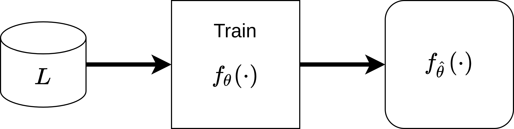
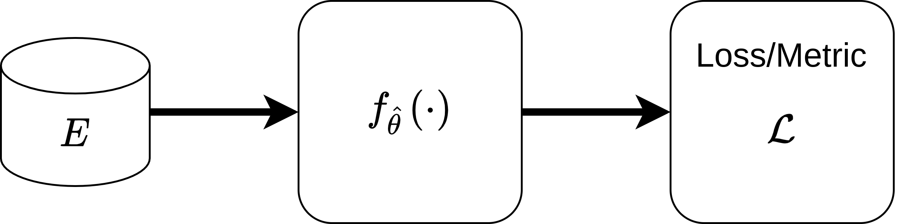

.. _whatisal:

What is Active Learning?
========================

Machine learning models, particularly those based on deep learning, play an increasing role in scientific research and
the broader society due to their strong performances and ability to generalise across tasks and domains. However, the
success of recent machine learning models has largely been dictated by large annotated datasets and well designed inductive biases.
Unfortunately, many important domains -- such as chemistry, biology, and medicine -- operate in low data regimes,
especially when the amount of data is compared to the incredibly rich and complex representations each observation is
encoded in. This is partially because it is expensive to label observations, requiring large material and human expenses.

Therefore, if we have the capability to obtain annotations from an oracle it is in our interest to give labels to
observations that are most ***informative*** to improving the model's performance economically. This motivation serves
as the foundation for research and development in **active learning**.

Active learning is a machine learning paradigm where the aim is to develop methods, or **strategies**, which propose
observations for labelling by an *oracle* for inclusion in the data used to train a set model in a subsequent
training cycle. Active learning is not a novel concept and is known under different names in various domains, for instance
*optimal experiment design* in statistics. It also utilises ideas from a wide variety of domains such as information theory,
reinforcement learning, game theory, and machine learning to name a few. To build our intuition for active learning and
its terminology, we take a step back and look at the aims and pipelines of standard machine learning development paradigm.
Then we compare this to the aims and pipelines of active learning. Along the way we demonstrate how **PyRelationAL** can
help implement active learning strategies for all kinds of data and models rapidly and reliably.

The standard machine learning paradigm
--------------------------------------

In a typical (supervised) machine learning setting we are given a labelled dataset :math:`L` and tasked with training a
model :math:`f_{\theta}` with parameters :math:`\theta` to produce the function  :math:`f_{\hat{\theta}}`.

The performance of :math:`f_{\hat{\theta}}` is evaluated on some hold out labelled test set :math:`E` via some task specific
metric of interest (AUC, accuracy, precision, MSE, etc. as in the example below) which
quantifies the quality of the model with respect to the task.

This is the standard machine learning paradigm. The ML practitioner's job is to improve the model :math:`f_{\theta}`
through different modelling choices, architecture changes, optimisation changes, new inductive biases,
hyperparameter searches, etc. etc.

The active learning paradigm
----------------------------

.. image:: al_pipeline.png
  :width: 100%
  :alt: The standard ML evaluation pipeline.

In active learning we assume the model :math:`f_{\theta}` is *set*. Instead, we are interested in *adding useful and
informative observations to* training data :math:`L` so that the performance of the model improves in a future round
of training and evaluation.

By nature, this is an iterative process following several *active learning rounds*
starting from round :math:`k=0` to :math:`K>0` set by some labelling budget or we run out of observations to label.
Given the training data at round :math:`k`, :math:`L_k`, The active learning practitioner's job is to design **strategies**
that will select or suggest **informative** observations to an oracle capable of providing labels --- then, construct an improved
training dataset :math:`L_{k+1}` which will improve the model's understanding of the underlying data distribution and hopefully
improve it's performance on the task.

The figure above summarises a generic active learning cycle. In this setup we have:

* A dataset of observations :math:`D`, which is split into
    * a labelled subset :math:`L`
    * an unlabelled subset :math:`U`
* A fixed model :math:`f_{\theta}`, which will be trained on :math:`L`
* An oracle which can provide labels to unlabeled observations :math:`u \in U`
* An active learning strategy, which in this case is split into
    * a informativeness function :math:`g`
    * a selection function SELECT, which selects observations based on the informativeness values coming from :math:`g`.

Starting as before we use :math:`L` to train a model and produce :math:`f_{\hat{\theta}}`. We can optionally evaluate the
performance of this model based on the current iteration of :math:`L` with a hold-out test set :math:`E`. In order to suggest
useful observations to the oracle, we have to be able to compute the *informativeness* of observations.

"Informativeness" is a measure which encapsulates how useful we believe labelling an observation will be to improving our model.
Computing informativeness values stands at the very core of all active learning strategies. In Bayesian optimisation based active
learning strategies, the acquisition function computes informativeness values so this term pops up often as well.
Many different informativeness measures exist, one family of informativeness measures stems from the model's uncertainty about
its prediction. The intuition is that observations with high uncertainty in the posterior predictive distribution are
useful and hence "informative" [#f1]_.

Our figure follows this logic. We use the trained model :math:`f_{\hat{\theta}}` to make predictions for each of the
unlabelled observations :math:`f_{\hat{\theta}}(u) \textrm{for} u \in U` [#f2]_. :math:`g(\cdot)` is a function for computing
uncertainty over predictions, :math:`g(f_{\hat{\theta}}(u))` and will give us an informativeness score for each :math:`u \in U`
that we can then rank and pick to be labelled by the oracle using the selection logic specified by SELECT.
Once labelled the cycle begins again, hopefully increasing our test performance in subsequent iterations.

That's it, this is the workflow and set of principles behind almost all active learning strategies[#f3]_. Of course,
The additional data, processes, and iterative nature of the active learning pipeline necessitates several new components.
This is where PyRelationAL comes in.

Active learning scenarios
-------------------------

There are several active learning scenarios:

1. Pool-based active learning
2. Stream-based selective sampling
3. Membership query synthesis

Pool-based sampling is the most common scenario and the form PyRelationAL primarily supports through its data management and pipeline
modules. In pool-based sampling, we have access to the entirety of :math:`D` and through it the: :math:`L`, :math:`U` subsets. At each
active learning round, we consider the entirety of :math:`U` and select the most informative points based on the strategy from this pool.

As the name suggests, stream-based selective sampling is based in data streaming scenarios where the model is streamed observations.
The active learning strategy in this scenario is tasked with deciding whether the current observation being seen should be labelled or not.
In other words, we only can see a small sample of :math:`U` at any time, and make a decision on whether it should be labelled, at that moment
in time. In PyRelationAL, we can interface with these scenarios by adjusting the pipeline modules.

Finally, in membership query synthesis the active learning strategy utilises the model to generate samples that should be labelled.

We can see that the generic active learning pipeline from above applies in all of these scenarios with minor adjustment.

The components and functionalities necessary for active learning
----------------------------------------------------------------

The additional data, processes, and iterative nature of the active learning pipeline necessitates several new components
that are common to all active learning setups.

* We need some form of a `DataManager` that reliably keeps track of the changing :math:`\mathcal{D}`, :math:`L`, and
  :math:`U` sets for our datasets as observations will move between them over active learning iterations. It will have to
  generate the appropriate sampling, batching, and data loading procedures in a scalable manner.
* For inherently non-probabilistic models that produce point estimate predictions like neural networks, we require a
  framework and methods for Bayesian approximation, such that we may estimate uncertainties.
* We would benefit from having various informativeness measures based on model uncertainty, information theory, diversity
  sampling etc.
* We need an arbiter of the active learning strategy. Something that considers iterative pipeline as a whole, using the
  DataManager, the model, the informativeness score function, and decides upon which :math:`u \in U` we propose to an oracle.
  Then takes the new labels and changes :math:`L` and :math:`U` accordingly.

We incorporate all of these components in **PyRelationAL** to allow users to rapidly build active learning pipelines with their
own datasets, models, and strategies inspired by the PyTorch workflow. We hope that this encourages the
application/re-implementation of existing strategies and creation of novel strategies to further the field of active
learning and the many real-world problems it promises to solve.

Click on the QuickStart for a guided introduction to **PyRelationAL** as well as the other tutorials for wrapping your own
datasets, models, performing bayesian approximation, creating your own novel active learning strategies!

.. rubric:: Footnotes

.. [#f1] There are many uncertainty measures differing between models for classification and regression, many of them included in **PyRelationAL**!
.. [#f2] For diversity sampling or model agnostic based strategies this step is not necessary. For example, imagine a strategy where we randomly pick observations for labelling; there's no need to use the model.
.. [#f3] In essence, active learning is a non-differentiable optimisation problem. We are interested in obtaining observations containing high information about the data distribution. It is often compared to Bayesian optimisation, which is often used to explore the space of model hyper-parameters to find the best model for the task at hand. Of course, Bayesian optimisation would be a valid strategy for active learning if we fix the model and optimise over observations to select instead of hyper-parameters. For more on the differences between active learning and bayesian optimisation, you can look at this article by Agnihotri and Batra (distill.pub/2020/bayesian-optimization/).
