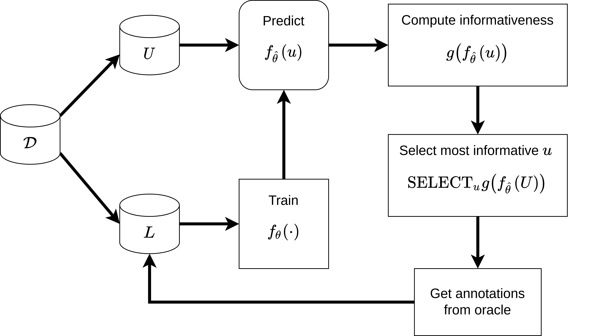

.. _whatisal:

What is Active Learning?
========================
Machine learning models, particularly those based on deep learning play an increasing role in scientific research and
the broader society due to their strong performances and ability to generalise across tasks and domains. However, the
success of deep learning models has largely been dictated by large annotated datasets and well designed inductive biases.
Unfortunately, many important domains -- such as chemistry, biology, and medicine -- operate in low data regime,
especially when the amount of data is compared to the incredibly rich and complex representations each observation is
encoded in. This is partially because it is expensive to label observations, requiring large material and human expenses.

Hence, if we have the capability of obtaining annotations from an oracle it is in our interest to give labels to
observations that are most *informative* to improving the model's performance economically. This motivation serves
as the foundation for active learning development.

Active learning is a machine learning paradigm where the aim is to develop methods, or **strategies**, which propose
observations for labelling by an *oracle* for inclusion in the data used to train a set model in a subsequent
training cycle. Active learning is not a novel concept and is known under different names in various domains, for instance
*optimal experiment design* in statistics. To build our intuition for active learning and its terminology, we
take a step back and look at the aims and pipelines of standard machine learning development paradigm. Then we compare
this to the aims and pipelines of active learning. Along the way we demonstrate how **PyRelationAL** can help implement active
learning strategies for all kinds of data and models rapidly and reliably.

The standard machine learning paradigm
--------------------------------------

In a typical (supervised) machine learning setting we are given a labelled dataset :math:`L` and tasked with training a
model :math:`f_{\theta}` with parameters :math:`\theta` to produce the function  :math:`f_{\hat{\theta}}`.

Performance of :math:`f_{\hat{\theta}}` is evaluated on some hold out labelled test set :math:`E` via some task specific
metric of interest (AUC, accuracy, precision, MSELoss, or :math:`\mathcal{L}_{\textrm{loss}}` in the example below) which
quantify the quality of the model with respect to the task.

The ML practitioner is concerned with improving the model :math:`f_{\theta}` through different modelling choices,
architecture changes, optimisation changes, hyperparameter search, etc. etc.

The active learning paradigm
----------------------------

In contrast within active learning we assume the model is set and we do not just work with the labelled set :math:`L` for
training. We assume there is a dataset :math:`\mathcal{D}` which contains labelled subset :math:`L` and an ***unlabelled***
subset :math:`U`. We are interested in iteratively labelling small groups of observations from :math:`U` for inclusion
:math:`L` in a subsequent active learning cycle.

Starting as before we use :math:`L` to train a model and produce :math:`f_{\hat{\theta}}`. We could evaluate the
performance of this set model based on the current iteration of :math:`L` with the test set :math:`E` again. We will
then use the trained model :math:`f_{\hat{\theta}}` to make predictions for each of the unlabelled observations
:math:`f_{\hat{\theta}}(u) \textrm{for} u \in U` [#f1]_. We follow this up with computing an ***informativeness*** score
for :math:`u`. This "informativeness" is a measure which encapsulates how useful we believe labelling this observation will be.
Many different informativeness measures exist, one family of informativeness measures stems from the model's uncertainty about
its prediction. The intuition is that observations with high uncertainty in the posterior predictive distribution are
useful and hence "informative" [#f2]_. Applying this example to our figure, if :math:`g(\cdot)` a function for computing
uncertainty over predictions, :math:`g(f_{\hat{\theta}}(u))` will give us an informativeness score for each :math:`u`
that we can then rank and pick to be labelled by the oracle. Once labelled the cycle begins again, hopefully increasing
our test performance in subsequent iterations.

That's it, this is the workflow and set of principles behind almost all active learning strategies.

The components and functionalities necessary for active learning
----------------------------------------------------------------

The additional data, processes, and iterative nature of the active learning pipeline necessitates several new components
that are common to all active learning setups.

* We need some form of a `DataManager` that reliably keeps track of the changing :math:`\mathcal{D}`, :math:`L`, and
  :math:`U` sets for our datasets as observations will move between them over active learning iterations. It will have to
  generate the appropriate sampling, batching, and data loading procedures in a scalable manner.
* For inherently non-probabilistic models that produce point estimate predictions like neural networks, we require a
  framework and methods for Bayesian approximation, such that we may estimate uncertainties.
* We would benefit from having various informativeness measures based on model uncertainty, information theory, diversity
  sampling etc.
* We need an arbiter of the active learning strategy. Something that considers iterative pipeline as a whole, using the
  DataManager, the model, the informativeness score function, and decides upon which :math:`u \in U` we propose to an oracle.
  Then takes the new labels and changes :math:`L` and :math:`U` accordingly.

We incorporate all of these components in **PyRelationAL** to allow users to rapidly build active learning pipelines with their
own datasets, models, and strategies inspired by the PyTorch workflow. We hope that this encourages the
application/re-implementation of existing strategies and creation of novel strategies to further the field of active
learning and the many real-world problems it promises to solve.

Click on the QuickStart for a guided introduction to **PyRelationAL** as well as the other tutorials for wrapping your own
datasets, models, performing bayesian approximation, creating your own novel active learning strategies!

.. rubric:: Footnotes

.. [#f1] For diversity sampling or model agnostic based strategies this step is not necessary. For example, imagine a strategy where we randomly pick observations for labelling; there's no need to use the model.
.. [#f2] There are many uncertainty measures differing between models for classification and regression, many of them included in **PyRelationAL**!
