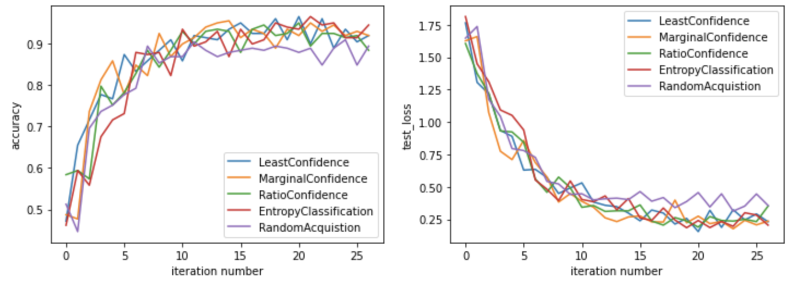

Quickstart and introduction by example
======================================

As discussed in the :ref:`whatisal` section, the **PyRelationAL** package decomposes the active learning workflow into four
main components: 1) a data manager, 2) a model, 3) an acquisition strategy built around an informativeness measure,
and 4) an oracle. Note however, that the oracle is external to the package. In this section, we work through an example
to illustrate how to instantiate and combine a data manager, a model, and an acquisition strategy.

Data Manager
------------

The data manager (:py:class:`pyrelational.data.data_manager.DataManager`) wraps around a PyTorch
Dataset and handles dataloader instantiation as well as tracking and updating of labelled and unlabelled sample pools.
In this example, we consider the `digit dataset <https://scikit-learn.org/stable/modules/generated/sklearn.datasets.load_digits.html>`_
from scikit-learn. We first create a pytorch dataset for it

.. code-block:: python

    import torch
    from torch.utils.data import Dataset
    from sklearn.datasets import load_digits

    class DigitDataset(Dataset):
        """ Sklearn digit dataset
        """
        def __init__(self):
            super(DigitDataset, self).__init__()
            sk_x, sk_y = load_digits(return_X_y=True)
            self.x = torch.FloatTensor(sk_x) # data
            self.y = torch.LongTensor(sk_y) # target

        def __len__(self):
            return self.x.shape[0]

        def __getitem__(self, idx):
            return self.x[idx], self.y[idx]

We then use this dataset object to instantiate a data manager, providing it with train, validation, and test sets.
Note that the train set is further split into labelled and unlabelled pools. The former corresponds to the samples whose labels
are available at the start, and the latter to the set of samples whose labels are hidden from the model and that can be queried
at each iteration by the active learning strategy.

.. code-block:: python

    from pyrelational.data.data_manager import DataManager

    def get_digit_data_manager():
        ds = DigitDataset()
        train_ds, valid_ds, test_ds = torch.utils.data.random_split(ds, [1400, 200, 197])
        train_indices = train_ds.indices
        valid_indices = valid_ds.indices
        test_indices = test_ds.indices
        labelled_indices = (
            train_indices[:labelled_size] if not labelled_size is None else None
        )

        return DataManager(
                            ds,
                            train_indices=train_indices,
                            validation_indices=valid_indices,
                            test_indices=test_indices,
                            labelled_indices=labelled_indices,
                            loader_batch_size=10,
                        )

See :ref:`using own data` for more details on how to interface datasets with **PyRelationAL** data manager.

Model
-----

Now that our data manager is ready, we demonstrate how to define a machine learning model to interact with it.
A **PyRelationAL** model wraps a user defined ML model (e.g. PyTorch Module, Pytorch Lightning Module, or scikit-learn estimator) and
handles instantiation, training, testing, as well as uncertainty quantification (e.g. ensembling, MC-dropout).
It is also compatible with ML models that directly estimate their uncertainties such as Gaussian Processes
(see `demo <https://github.com/RelationRx/pyrelational/examples/demo/model_gaussianprocesses.py>`_ on source repository).
Continuing with our example, we define a pytorch lightning module to perform digit classification on the dataset defined
in the previous section.

.. code-block:: python

    import torch
    import torch.nn as nn
    import torch.nn.functional as F
    from sklearn.metrics import accuracy_score
    from pytorch_lightning import LightningModule

    class DigitClassifier(LightningModule):
        """Custom module for a simple convnet classifier"""

        def __init__(self, dropout_rate=0):
            super(DigitClassifier, self).__init__()
            self.layer_1 = nn.Linear(8*8, 16)
            self.layer_2 = nn.Linear(16, 32)
            self.dropout = nn.Dropout(dropout_rate)
            self.layer_3 = nn.Linear(32, 10)

        def forward(self, x):
            x = self.layer_1(x)
            x = F.relu(x)
            x = self.layer_2(x)
            x = F.relu(x)
            x = self.dropout(x)
            x = self.layer_3(x)
            x = F.log_softmax(x, dim=1)
            return x

        def training_step(self, batch, batch_idx):
            x, y = batch
            logits = self(x)
            loss = F.nll_loss(logits, y)
            return loss

        def validation_step(self, batch, batch_idx):
            x, y = batch
            logits = self(x)
            loss = F.nll_loss(logits, y)
            self.log("loss", loss.item())
            return loss

        def test_step(self, batch, batch_idx):
            x, y = batch
            logits = self(x)
            loss = F.nll_loss(logits, y)
            self.log("test_loss", loss)

            # compute accuracy
            _, y_pred = torch.max(logits.data, 1)
            accuracy = accuracy_score(y, y_pred)
            self.log("accuracy", accuracy)

        def configure_optimizers(self):
            optimizer = torch.optim.Adam(self.parameters(), lr=1e-3)
            return optimizer

Once defined, the lightning model can then be wrapped into a **PyRelationAL** model to interact with the active learning strategies.
Note that at the moment, **PyRelationAL** defines MCDropout and Ensemble wrapper to approximate Bayesian uncertainty of arbitrary models.
You can find the existing models and templates in :mod:`pyrelational.models.generic_model`. The code snippet below
demonstrate how to simply integrate the model above with either mc-dropout or ensembling **PyRelationAL** models.

.. code-block:: python

    from pyrelational.models.mcdropout_model import LightningMCDropoutModel
    model = LightningMCDropoutModel(
                DigitClassifier,
                {"dropout_rate":0.3},
                {"epochs": 4},
                n_estimators=25,
                eval_dropout_prob=0.5,
            )

    from pyrelational.models.ensemble_model import LightningEnsembleModel
    model = LightningMCDropoutModel(
                DigitClassifier,
                {"dropout_rate":0.3},
                {"epochs": 4},
                n_estimators=25,
            )

See :ref:`build your own model` for more examples on how to create custom models.

Strategy
------------------------

With data manager and model ready, we only need to choose an informativeness measure to define our strategy and instantiate
an active learning loop. The informativeness measure serves as the basis for the selection of the query sent to the
oracle for labelling. We define various strategies in :mod:`pyrelational.strategies` for classification, regression, and task-agnostic scenarios based on
different measure of informativeness defined in :mod:`pyrelational.informativeness`.
For instance, we can apply a least confidence strategy to our digit classification problem with
a few lines of code

.. code-block:: python

    from pyrelational.strategies.classification import (
        LeastConfidenceStrategy,
    )
    strategy = LeastConfidenceStrategy(data_manager=dm, model=model)
    strategy.theoretical_performance()
    strategy.full_active_learning_run(num_annotate=250)
    performance_history = strategy.performance_history()

See :ref:`using own strategy` for more examples.

Comparing performances of different strategies
----------------------------------------------

We can now compare the performances of different strategies on our digit classification problem

.. code-block:: python

    from pyrelational.data.data_manager import DataManager
    from pyrelational.strategies.classification import (
        LeastConfidenceStrategy,
        MarginalConfidenceStrategy,
        RatioConfidenceStrategy,
        EntropyClassificationStrategy,
    )
    from pyrelational.strategies.task_agnostic import RandomAcquisitionStrategy
    query = dict()
    num_annotate = 50

    # Least confidence strategy
    dm = get_digit_data_manager()
    strategy = LeastConfidenceStrategy(data_manager=dm, model=model)
    strategy.theoretical_performance()
    strategy.full_active_learning_run(num_annotate=num_annotate)
    query['LeastConfidence'] = strategy.performance_history()

    # Maginal confidence
    dm = get_digit_data_manager()
    strategy = MarginalConfidenceStrategy(data_manager=dm, model=model)
    strategy.theoretical_performance()
    strategy.full_active_learning_run(num_annotate=num_annotate)
    query['MarginalConfidence'] = strategy.performance_history()

    # Ratio confidence
    dm = get_digit_data_manager()
    strategy = RatioConfidenceStrategy(data_manager=dm, model=model)
    strategy.theoretical_performance()
    strategy.full_active_learning_run(num_annotate=num_annotate)
    query['RatioConfidence'] = strategy.performance_history()

    # Entropy classification
    dm = get_digit_data_manager()
    strategy = EntropyClassificationStrategy(data_manager=dm, model=model)
    strategy.theoretical_performance()
    strategy.full_active_learning_run(num_annotate=num_annotate)
    query['EntropyClassification'] = strategy.performance_history()

    # Random classification
    dm = get_digit_data_manager()
    strategy = RandomAcquisitionStrategy(data_manager=dm, model=model)
    strategy.theoretical_performance()
    strategy.full_active_learning_run(num_annotate=num_annotate)
    query['RandomAcquistion'] = strategy.performance_history()

Which give the results in the plot below, where we observe some improvement over a random strategy.

