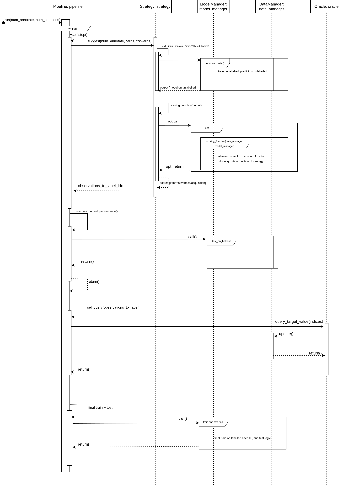

.. _using own pipeline:

Extending Pipelines
===================

PyRelational comes with several standard active learning strategies. However, the real strength of this library
lies in it's support for implementing your own bespoke strategies with different informativeness measures,
acquisition functions, batching logic, etc.

PyRelationAL is primarily focused on pool-based sampling scenarios (see: What is Active Learning? :ref:`_whatisal`), and provides
`Pipeline`s that can be used to organise the interactions between a data_manager, model_manager, strategy, and oracle
implementations. The central method in the Pipeline is the `run()` method which runs the active learning loop and
dictates the communication between different communications for all of the loops. Let's look at the most basic
version of this as implemented in our abstract class :py:meth:`pyrelational.pipeline.Pipeline`

.. code-block:: python

    def run(
        self,
        num_annotate: int,
        num_iterations: Optional[int] = None,
        test_loader: Optional[DataLoader[Any]] = None,
        *strategy_args: Any,
        **strategy_kwargs: Any,
    ) -> None:
        """
        ... Docstrings removed for brevity
        """
        iter_count = 0
        while len(self.u_indices) > 0:
            iter_count += 1

            # Obtain samples for labelling and pass to the oracle interface if supplied
            observations_for_labelling = self.step(num_annotate, *strategy_args, **strategy_kwargs)

            # Record the current performance
            self.compute_current_performance(
                test_loader=test_loader
            )

            # Query the oracle for the labels of the selected samples
            self.query(
                observations_for_labelling,
            )
            if (num_iterations is not None) and iter_count == num_iterations:
                break

        # Final update the model and check final test performance
        self.model_manager.train(self.l_loader, self.valid_loader)
        self.compute_current_performance(test_loader=test_loader)

Looking at this code block we can see that the `run()` method is a while loop that runs until we expend all of the
unlabelled data or we hit a predefined number of iterations that represents our budget. At each iteration we call:

1. the `step()` method which is responsible for selecting the next batch of samples to be labelled. This method
   is implemented in the concrete `Strategy` class and is responsible for selecting the next batch of samples to be
   labelled.
2. the `compute_current_performance()` method which is responsible for computing the current performance of the model
3. the `query()` method which is responsible for querying the oracle for the labels of the selected samples

After the loop is finished, we just perform a final training and evaluation of the model. Of most interest is probably
the step method, which is the method that will call upon the Strategy, and will have to be overwritten if you change
the return data structure of the __call__ method in the Strategy class. Note that, if this is done, you will also have
to change the run method in the Pipeline class to reflect this change as well. This coupling is necessary to ensure that
the pipeline can be used with a wide variety of strategy implementations.

Implementing completely new Pipelines
=====================================

Occasionally, you may want to implement a completely new pipeline that does not fit into the pool-based sampling
scenario, such as stream-based sampling. In this case, you will have to implement a new pipeline class that inherits
from the abstract Pipeline class and overwrite the relevant methods to accommodate a stream-based data scenario.

To help with this process, we provide a sequence diagram below that shows the interactions between the different
data_manager, model_manager, strategy, and oracle implementations for an uncertainty sampling strategy. This should
help you understand the interactions between the different components and how they can be modified to suit your needs.

    Sequence Diagram showing the interactions between the different components in the pipeline
