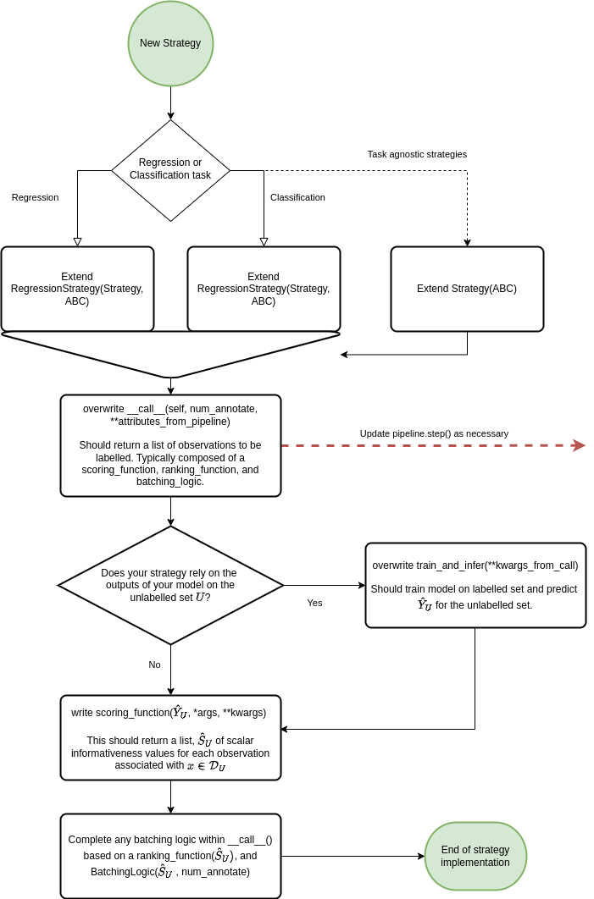

.. _using own strategy:

Implementing strategies
=======================

PyRelational comes with several standard active learning strategies. However, the real strength of this library
lies in it's support for implementing your own bespoke strategies with different informativeness measures,
acquisition functions, batching logic, etc.

In PyRelationAL, a `Strategy` suggests what indices of the queryable set of observations in the data-manager
(often just the unlabelled set in pool based sampling) that should be annotated next. The `Strategy` is implemented as a class with a
`__call__()` method that takes the number of annotations to query, and returns a list of dataset indices
to annotate. It is this `__call__()` method that will be called by the `Pipeline` object whenever we run an
iteration of the active learning loop. Thereby, it should contain all of the logic of the strategy, and if
using a PyRelationAL Pipeline, the `__call__()`.

Whilst the user is obviously free to implement the __call__() method in any way they see fit, we find that
most strategies can be broken down into a series of three steps which reflect the structure of our
implementations. These steps are:

1. `scoring_function`: assigns an informativeness score to each observation in the queryable set.
2. `ranking_function`: sorts the queryable set based on the informativeness scores. As it's name suggests, it is often just about ranking the observations by their informativeness as computed in the `scoring_function`
3. `batching_logic`(num_annotate=N): selects the top N observations to annotate based on some batching logic. There is a lot of variety that can be incorporated here. For example, BatchBALD may theoretically be combined with various model outputs and informativeness scoring functions to derive new strategies.

For example an epsilon-greedy least confidence strategy based on an ensemble of models can be decomposed into:

- A query-by-committee based `scoring_function` incorporating the variance of the outputs of the ensemble "committee" and its disagreement. Then adds a small random epsilon value.
- a `ranking_function` that "greedily" sorts the outputs of the `scoring_function` to pick the observation with the highest informativeness value.
- This strategy has no `batching_logic` so no implementation is made. The `__call__` function returns top output of the `ranking_function`

Below is a simple flowchart to guide the implementation of a custom strategy based on the above steps:

Depending on your use case you may want to return additional values from the strategy to the pipeline. In this case
you will have to modify the `__call__()` method of the strategy to return a tuple of values. The pipeline will then
also have to be modified to accept these additional values. For more information, see documentation on the pipeline.

.. full annotated example

Additional examples
===================

Let's look at some more examples utilising the various submodules of PyRelationAL to construct custom strategies.

Implementing a mixed strategy
_____________________________

In this example, we show how to implement a mixed strategy for a regression task using the least confidence scorer
for informativeness in combination with representative sampling. The step is decomposed in two steps:
1) identifying a subset of the queryable set based on the least confidence score (make sure that this subset is
sufficiently larger than the number of annotations we want to query) and 2) select representative samples from this
subset based on euclidean distance between input features.

.. code-block:: python

    import torch
    from pyrelational.informativeness import regression_least_confidence
    from pyrelational.informativeness.task_agnostic import representative_sampling
    from pyrelational.strategies.generic_al_strategy import Strategy

    class MixedStrategy(Strategy):
        """
        Implements a strategy that combines least_confidence scorer with representative sampling.
        To this end, 10 times more samples than requested are selected based on least_confidence scorer,
        the list is then reduced based on representative_sampling.
        """

        def __init(self):
            super(MixedStrategy, self).__init__()

        def __call__(self, num_annotate, data_manager, model_manager):
            output = self.train_and_infer(data_manager=data_manager, model_manager=model_manager)
            scores = regression_least_confidence(x=output)
            ixs = torch.argsort(scores, descending=True).tolist()
            ixs = [data_manager.u_indices[i] for i in ixs[: 10 * num_annotate]]
            subquery = torch.stack(data_manager.get_sample_feature_vectors(ixs))
            new_ixs = representative_sampling(subquery)
            return [ixs[i] for i in new_ixs]

Implementing an :math:`\epsilon`-greedy strategy
________________________________________________

In the second example, we implement an :math:`\epsilon`-greedy strategy: for :math:`N` queries, :math:`(1-\epsilon)N`
are selected greedily based on model prediction and :math:`\epsilon N` are selected uniformly at
random from the remaining queryable set.

.. code-block:: python

    import torch
    import numpy as np
    from pyrelational.informativeness import regression_mean_prediction
    from pyrelational.strategies.generic_al_strategy import Strategy

    class EpsilonGreedyStrategy(Strategy):
        """
        Implements an epsilon-greedy strategy, whereby a percentage of the samples to annotate
        are selected randomly while the remaining are selected greedily.
        """

        def __init(self):
            super(EpsilonGreedyStrategy, self).__init__()

        def __call__(self, num_annotate, data_manager, model_manager, eps=0.05):
            assert 0 <= eps <= 1, "epsilon should be a float between 0 and 1"
            output = self.train_and_infer(data_manager=data_manager, model_manager=model_manager)
            scores = regression_mean_prediction(x=output)
            ixs = torch.argsort(scores, descending=True).tolist()
            greedy_annotate = int((1-eps)*num_annotate)
            ixs = [data_manager.u_indices[i] for i in ixs[: greedy_annotate]]
            remaining_u_indices = list(set(data_manager.u_indices) - set(ixs))
            random_annotate = np.random.choice(remaining_u_indices, num_annotate-greedy_annotate, replace=False)
            return ixs + random_annotate.tolist()

See the `examples folder <https://github.com/RelationRx/pyrelational/examples>`_ in the source repository for more examples.
